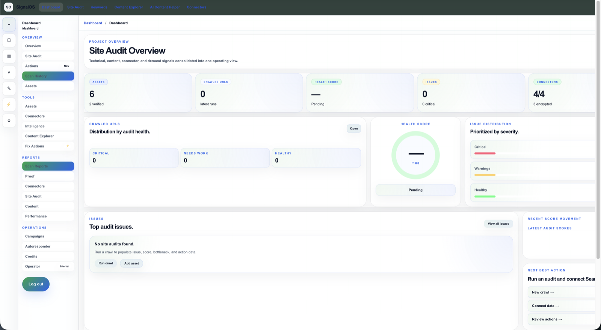
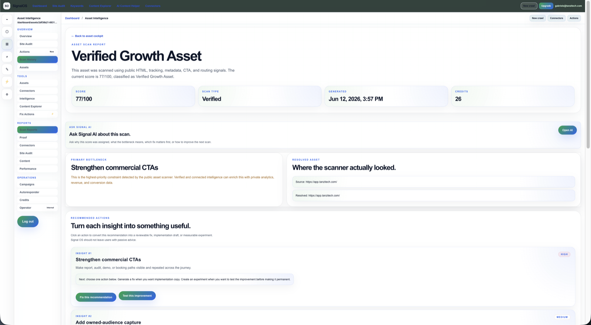
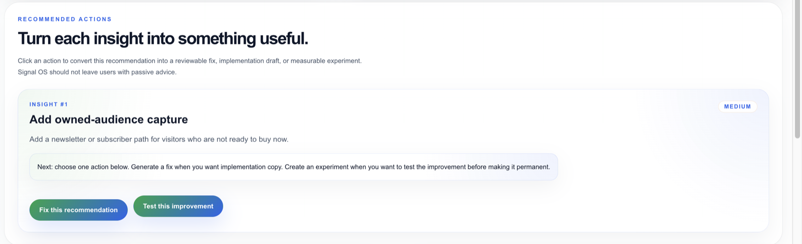
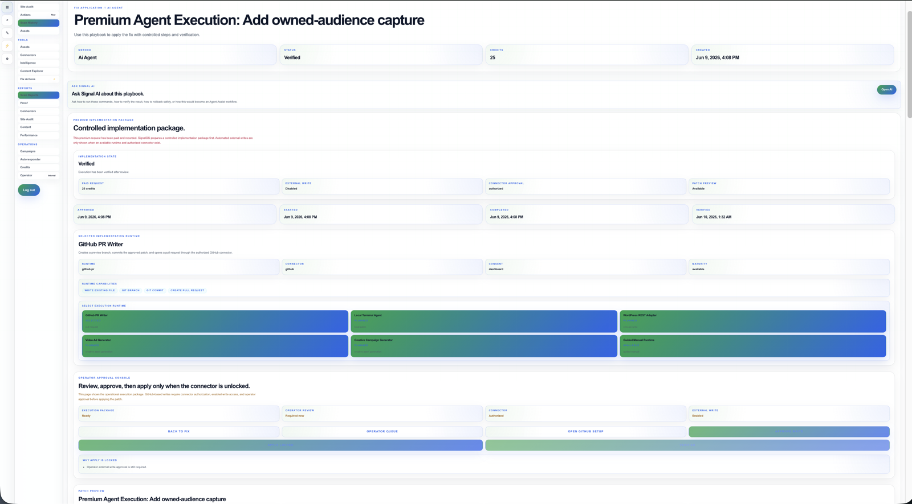
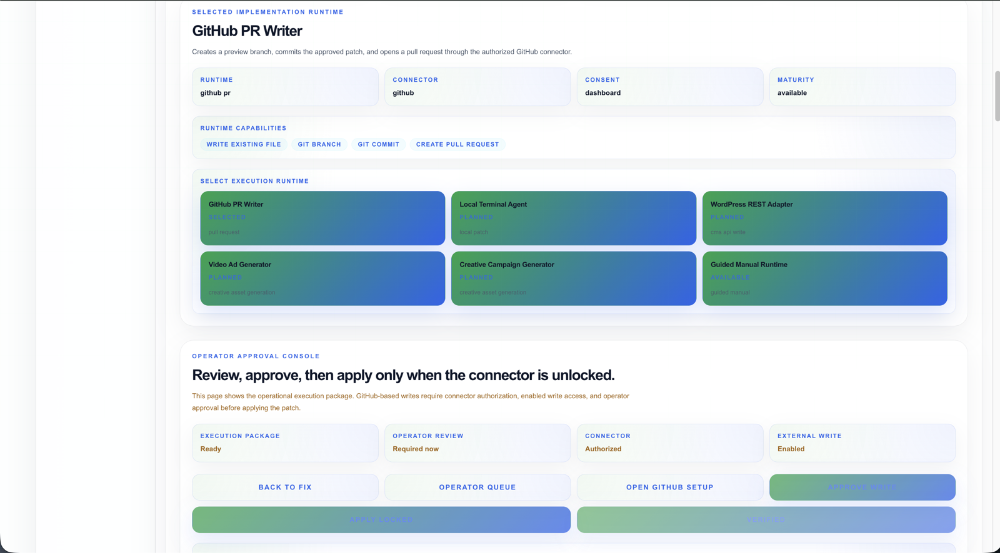
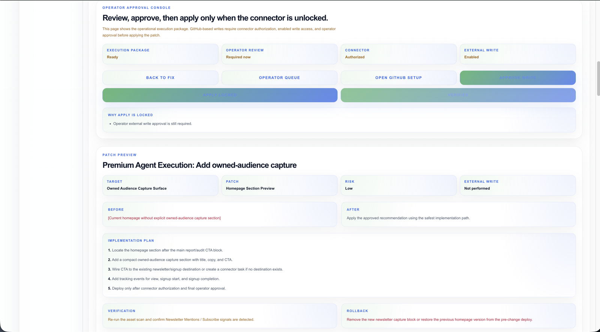

# SignalOS Product Walkthrough

This walkthrough shows the current SignalOS controlled public beta from asset intelligence through verified GitHub execution.

All screenshots use sanitized beta data. Sensitive information, credentials, and private customer data are excluded.

---

## 1. Asset and growth operations dashboard

The dashboard provides a central view of:

- connected assets;
- scan activity;
- recommendation status;
- execution progress;
- operator actions;
- growth and pipeline signals.

The objective is to make the next useful action visible without requiring the user to interpret raw technical data.

---

## 2. Scan report and diagnostic evidence

A completed scan turns public asset observations into a structured report.

The report is designed to show:

- overall diagnostic status;
- evidence connected to each finding;
- growth and conversion gaps;
- measurement and audience-capture signals;
- prioritized next steps;
- saved report history.

The report should explain both **what is missing** and **why it matters commercially**.

---

## 3. Recommendation and implementation detail

Each recommendation provides a reviewable implementation unit rather than a generic suggestion.

A recommendation may include:

- the detected problem;
- expected business impact;
- target surface;
- implementation instructions;
- risk level;
- tracking requirements;
- verification criteria;
- rollback guidance.

Users remain responsible for reviewing and approving every recommendation.

---

## 4. Premium Agent execution package

The Premium Agent converts an approved recommendation into an execution-ready package.

The package is intended to make the proposed action explicit before any external write occurs.

It can contain:

- implementation content;
- exact execution target;
- patch preview;
- tracking events;
- safety requirements;
- verification conditions;
- rollback instructions;
- runtime selection.

No external action should occur merely because the package was generated.

---

## 5. GitHub target control and approval

The GitHub runtime uses layered authorization.

The operator controls:

- GitHub authorization;
- exact repository;
- exact base branch;
- exact target file;
- connector write approval;
- individual application approval.

Changing the protected target should invalidate the previous write approval.

The runtime is designed to create an isolated branch and pull request rather than writing directly to the configured base branch.

---

## 6. Verified external execution

A GitHub application can be marked verified only after a real external write has occurred and execution metadata is available.

The verified result records:

- execution status;
- write status;
- repository;
- base branch;
- preview branch;
- target path;
- commit;
- pull request;
- verification result;
- relevant timestamps.

The generated pull request remains subject to human review. Verification does not automatically merge or deploy the change.

---

## End-to-end control model

The current controlled GitHub workflow follows this sequence:

1. Scan an authorized asset.
2. Review diagnostic evidence.
3. Select and approve a recommendation.
4. Generate a Premium Agent package.
5. Authorize the GitHub connector.
6. Configure the exact repository, branch, and file.
7. Approve the connector target.
8. Review the patch preview.
9. Approve the individual application.
10. Apply the external write.
11. Review the generated branch, commit, and pull request.
12. Verify the result in SignalOS.
13. Merge, close, or revert through the normal human-controlled GitHub workflow.

---

## What this walkthrough demonstrates

The current beta demonstrates:

- evidence-based diagnostics;
- structured recommendations;
- reviewable execution packages;
- separate authorization layers;
- exact-target controls;
- isolated GitHub branches;
- real commits and pull requests;
- post-write verification;
- rollback and audit information.

SignalOS remains a controlled beta. Testers should use dedicated non-production assets and repositories.
